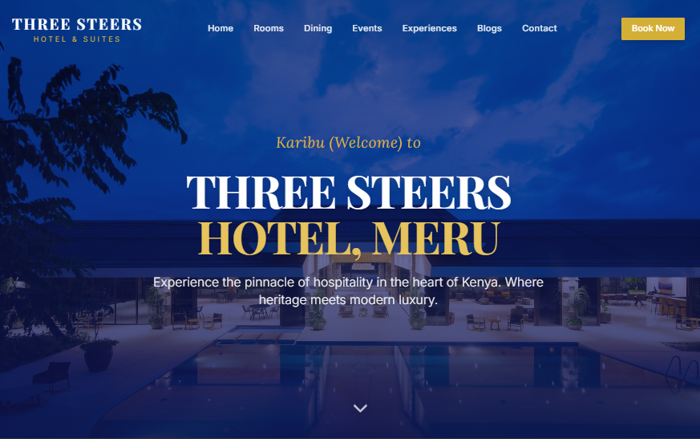

Three Steers Hotel – Modern Website Redesign

A fully modernized, luxury-themed hotel website redesign for Three Steers Hotel (Meru, Kenya).
Built to elevate the hotel’s digital presence with an elegant UI, seamless booking flow, and high-performance architecture.

🚀 Project Overview

This project redesigns the existing Three Steers Hotel website into a clean, luxurious, and fully responsive hospitality platform.
It blends the hotel’s traditional charm with high-end visuals, smooth animations, and a user-friendly experience tailored for both local and international guests.

🎨 Key Features
✨ UI / UX Enhancements

Full-screen hero section with cinematic visuals

Luxury color palette (Navy, Gold, Cream, Charcoal, Forest Green)

Elegant typography system (Playfair Display, Inter/Poppins, Lora)

Asymmetrical grids, card layouts, and advanced hover effects

Smooth page transitions & scroll-triggered animations

Mobile-first responsive design

🏨 Core Hotel Sections

About the Hotel + History Timeline

Rooms & Suites with filters, features, and 360° tours

Amenities (Spa, Restaurant, Conference spaces, Gym, etc.)

Gallery with masonry layout & lightbox view

Interactive map + Directions

Testimonials with rating integrations

Contact section with emails, phone numbers & map preview

🧩 Technical Highlights

Built with Next.js + React

Styled using Tailwind CSS

Animations via Framer Motion / AOS

Optimized images (WebP, Lazy Loading)

SEO-ready structure & metadata

Booking flow architecture (availability check + CTAs)

Google Maps integration

Fully responsive and accessibility-friendly

🛠 Tech Stack
Category	Tools
Framework	Next.js, React
Styling	Tailwind CSS
Animations	Framer Motion, AOS
Optimization	WebP, Lazy loading, Code splitting
Maps / Navigation	Google Maps Embed
Version Control	Git & GitHub
📍 Hotel Contact Details (From Current Website)

Emails:

reservation@threesteershotel.com

info@threesteershotel.com

Phone Numbers:

+254 728 588 005

+254 735 497 772

Location:
Three Steers Hotel, B6, Meru, Kenya
227KM from Nairobi (approx. 4.5 hours drive)

⚙️ Installation & Setup
| 
[git clone](https://github.com/Pantane1/ThreeSteers.git)

 Navigate to the folder
cd three-steers-hotel
Install dependencies
npm install
Start development server
npm run dev

The site will run at:
👉 http://localhost:3000

📦 Build for Production
npm run build
npm start

📁 Folder Structure (Standard Next.js)
/public
  /images
  favicon.ico

/src
  /components
  /pages
  /styles
  /sections
  /utils

README.md
package.json

👨‍💻 Developer

Built with passion by Pantane:

[email](emailto:pantane254@gmail.com)

[WhatsApp](https://wa.me/254740312402?text=Hi%20Pantane,%20Saw%20your%20website..I)

*If you'd like a website like this—or better—feel free to reach out.*

⭐ Contributions

Contributions, issues, and feature requests are welcome!
Open a pull request or issue anytime.

📜 License

This project is licensed under the MIT License – free for personal and commercial use.

>> **Great_Pantane**

  <a href="#">

